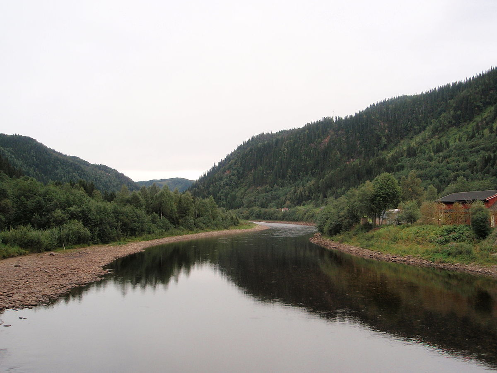
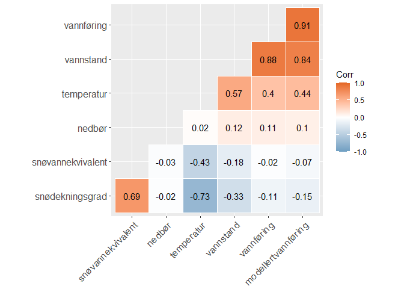
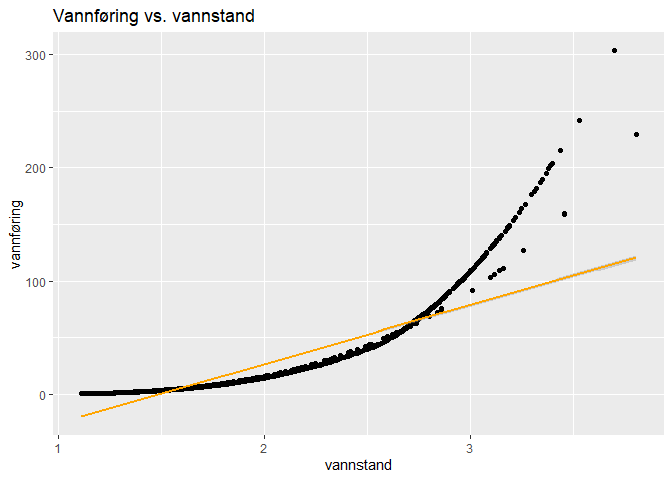
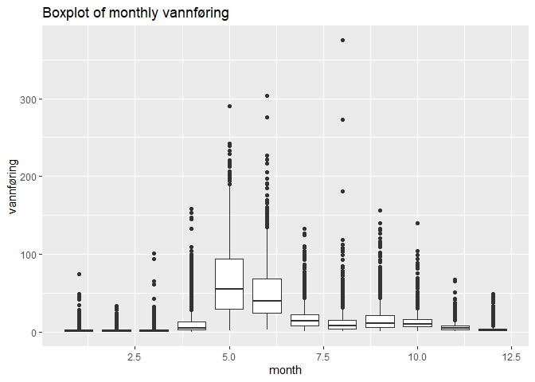

# :ocean: Modelling Water Flow with Shrinkage Methods

| Team Members in Alphabetical Order | Email | 
|---------|-----------------|
| <a href=https://github.com/ebbeberge> Eirik Berge </a> | eirik.berge@ntnu.no |
| <a href=https://github.com/cielveba> Camilla Idina Jensen Elvebakken </a> | cielveba@stud.ntnu.no |
| <a href=https://github.com/martilud> Martin Ludvigsen </a> | martilud@ntnu.no |

## Table of Contents
1. [TL;DR: Modeling Water Flow in Eggafossen](https://github.com/ebbeberge/water-flow-modeling#tldr-modeling-water-flow-in-eggafossen)
2. [Files and Dependencies](https://github.com/ebbeberge/water-flow-modeling#files-and-dependencies)
3. [Water Flow & Water Level in Norwegian Rivers](https://github.com/ebbeberge/water-flow-modeling#water-flow--water-level-in-norwegian-rivers)
   - [General About Water Flow and Water Level](https://github.com/ebbeberge/water-flow-modeling#general-about-water-flow-and-water-level)
   - [Eggafossen](https://github.com/ebbeberge/water-flow-modeling#eggafossen)
   - [The HBV model](https://github.com/ebbeberge/water-flow-modeling#the-hbv-model)
4. [A Brief View of the Eggafoss Data](https://github.com/ebbeberge/water-flow-modeling#a-brief-view-of-the-eggafoss-data)
5. [Models Developed](https://github.com/ebbeberge/water-flow-modeling#models-developed)
6. [Conclusions](https://github.com/ebbeberge/water-flow-modeling#conclusions)


## TL;DR: Modeling Water Flow in Eggafossen

We develop models that describe and predict water flow through the Eggafossen measuring station along the Gaula river in Trøndelag. Based on time series data provided by NVE (Norwegian Water Resources and Energy Directorate), we model the water flow at future times based on previous knowledge and compare our results with the [HBV model](https://en.wikipedia.org/wiki/HBV_hydrology_model) currently used. We are able to develop regression models that outperform the HBV models in pure prediction power of future events. Moreover, we develop alternative models that, although slightly weaker for prediction accuracy, are simpler and easier to interpret. To view the technical analysis done and models developed in R, see:

:rocket: [Water Flow Modeling](https://ebbeberge.github.io/water-flow-modeling/) :rocket:

## Files and Dependencies

- The data given to us by NVE can be found in separate csv-files in the folder `data`.
- The file `data_loading.R` is an R-script that merges the data together in a single csv-file called `raw_data_eggafoss.rds`.
- The data is subsequently cleaned, analysed, and used to build various models in the R-markdown document `index.Rmd`.
- A view of the cleaning, analysis, and modeling done can be found in `index.html`

To run the R-markdown-document, the folloing R-packages needs to be installed:

```
- data.table
- naniar
- reshape2
- ggplot2
- ggcorrplot
- h2o
- dplyr
- lubridate
- fastDummies
- glmnet
- leaps
- caret
- genlasso
```
To install the packages, see [Install Packages in R](https://www.rdocumentation.org/packages/utils/versions/3.6.2/topics/install.packages) for more information.

## Water Flow & Water Level in Norwegian Rivers

### General About Water Flow and Water Level



Statistical prediction of water flow (norsk: vannføring) and water level (norsk: vannstand) in rivers is an increasingly important problem. The problem is tightly linked with the prediction of floods. Because of climate change, the occurrence of floods is predicted to increase, and possibly in areas where floods have been historically rare:

[(Norwegian) Klima, nå og i framtiden](https://www.nve.no/klima/klima-na-og-i-framtiden/?ref=mainmenu)

Floods are potentially deadly for both humans and wildlife, and have huge economic consequences each year. Rivers are also an extremely important resource in many countries. In Norway, 90 % of produced electricity comes from hydropower:

[(Norwegian) Kraftproduksjon](https://energifaktanorge.no/norsk-energiforsyning/kraftforsyningen/)

Good statistical models for water flow and water level are important in order to optimize the production of electricity. The <i>Norwegian Water Resources and Energy Directorate (NVE)</i> has about 600 water level measurement stations all over Norway:

[(Norwegian) Stasjonsnettet](https://www.nve.no/hydrologi/vannstand-og-vannforing/stasjonsnettet/)

Measurements are going as far back as the 1940's. The <i>Norwegian Meteorological Institute (MET)</i> is responsible for the developed weather measurement and forecasting infrastructure in Norway. Many variables obtained by weather measurements, such as temperature, percipitation and snow content are traditionally used in physical models for water flow and water level. These physical models usually require parameter fitting and/or field experiments in order to yield good predictions. With the wealth of data available, it is worth considering purely data-driven approaches using measurements from NVE and MET to predict water flow and water level. In this report we will attempt to apply statistical shrinkage models to predict water flow at Eggafossen in Trøndelag, Norway. NVE was kind enough to give us water measurements and predictions from the model they are currently using, as well as weather data obtained from MET. 

### Eggafossen


Eggafossen is a location along the Gaula river in Trøndelag. Gaula as a whole is approximately 153 kilometers long and drains a watershed of about 3,661 square kilometres. The river runs through several populated areas as well as along the county road fv30, the highway E6 and the Rørosbanen train rail.

In 2011 there was a large flood in Trøndelag, mainly along the upper parts of Gaula. In particular, Ålen kommune, which is one of the largest population centers close to Eggafossen, suffered [large damages](https://www.dagbladet.no/nyheter/enorme-vannmasser-herjer-alen-sentrum/63582581). The Eggafoss station measured a water flow about 800 000 litres per second, whereas it normally measures about 20 000-30 000. Even though NVE has the responsibility of warning about floods, the 2011 flood was not predicted or warned about by NVE, and precautionary measurements were not taken. NVE stated in their own [report on the matter](https://publikasjoner.nve.no/dokument/2011/dokument2011_12.pdf):

>The risk of flood was underestimated because of several factors. The first percipitation predictions were too low. NVE's hydrological models were inadequate for the situation...

This motivates research on better prediction models.

### The HBV model
The [Hydrologiska Byråns Vattenbalansavdelig (HBV) model](https://en.wikipedia.org/wiki/HBV_hydrology_model) is a physical model designed for simulating river flow based on an advanced water balance calculation, specifically designed for rivers in Scandinavia.
The model is somewhat difficult to approach unless one has experience with hydrology, and we will not go into details here.

Because the HBV model most likely requires a data-driven fitting process, it is worth  asking: Is it possible to make comparable predictions to the HBV model 
using a purely data-driven model? The data driven model would have access to the same data
as the HBV model. If a purely data-driven model is shown to be as good or nearly as good as the HBV model, the model can easily be transferred to other measurement stations. Furthermore,
data-driven models can be used for inference in order to assess what actually causes water flow, and
can be used for confidence intervals and uncertainty measurements more easily than a physical model.

## A Brief View of the Eggafoss Data

The Eggafoss data is rectangular data representing various observables for each day in the period 1941-2019. The following variables are recorded:

#### **Variables**:
- **Nedbør** [m] (amount of rainfall)
- **Snødekningsgrad** [%] (a measure of snow covering)
- **SnøensVannekvivalent** [m] (a measure of how much water the snow consists of)
- **Temperatur** [°C] (temperature)
- **Vannføring (VF)** [m³/s] (water flow)
- **Vannstand (VST)** [m] (water level)
- **ModellertVannføring (MVF)** [m³/s] (the HBV model used by NVE to predict vannføring)

The following figure reveals that most of the data is missing in the time-peiod 1941-1958. As such this time-peiod is removed from the data.

<p align="center">
  
</p>

The following correlation plot shows that there is significant correlation between many of the variables. Notice that `ModellertVannføring` is the HBV model trying the predict `Vannføring`, so these variables are naturally highly correlated.

<p align="center">
  
</p>

Notice also that `Vannstand` and `Vannføring` are highly correlated. However, it is problematic to develop a model that uses `Vannstand` to predict `Vannføring`; we will typically not be able to measure `Vannstand` without also being able to measure `Vannføring`. Hence our models will not use `Vannstand` on the current day to predict the variable `Vannføring`. The following plot shows that there is a quadratic-like relaitonship between `Vannstand` and `Vannføring`:

<p align="center">
  
</p>

A final important remark about the data is the there is an obvious seasonallity to it. Floods are known to happen more frequently in certain parts of the year. The following boxplot illustrates how `Vannføring` varies over the 12 months (from January to December):

<p align="center">
  
</p>

## Models Developed

We develop several regression models to predict `Vannstand` based on the other variables in the past days. Some of the machine learning models that are utilized are:

- _Standard Linear Regression_
- _Weighted Linear Regression_
- _Backward Subset Selection_
- _Lasso Regulatization_
- _Elastic Net_
- _Fused Lasso Regularization_

We summarize our results in the following table.

| Model                 | Test MSE | Properties             | 
|-----------------------|----------|------------------------|
| HBV                   | 0.1670   | Smooth model
| Weighted Linear Regression          | 0.0548   | Large variance for low `vannføring`
| Weighted Linear Regression | 0.0514   | Large variance for low `vannføring`
| Backward Subset Selection    | 0.0541   | Sparse model
| Lasso Regulatization                | 0.0580   | Sparse model
| Elastic Net           | 0.0819   | Sparse model
| Fused Lasso Regularization | 0.1891      | Smooth(er) model

For more information about the models and their predictive power, see the technical analysis:

:rocket: [Water Flow Modeling](https://ebbeberge.github.io/water-flow-modeling/) :rocket:

## Conclusions

- Our most predictive model (`Weighted Linear Regression`) strongly outperform the HBV method for future predictions.
- We create highly interpretable models (with `Best Subset Selection` and `Lasso Regularization`) that include few variables in the model, while still outperforming the industry standard HBV that is currently used. These models are more straightforward to understand and apply. 
- We also create a model (with `Fused Lasso Regulatization`) that is more smooth, meaning that it varies less between days with similar values.
