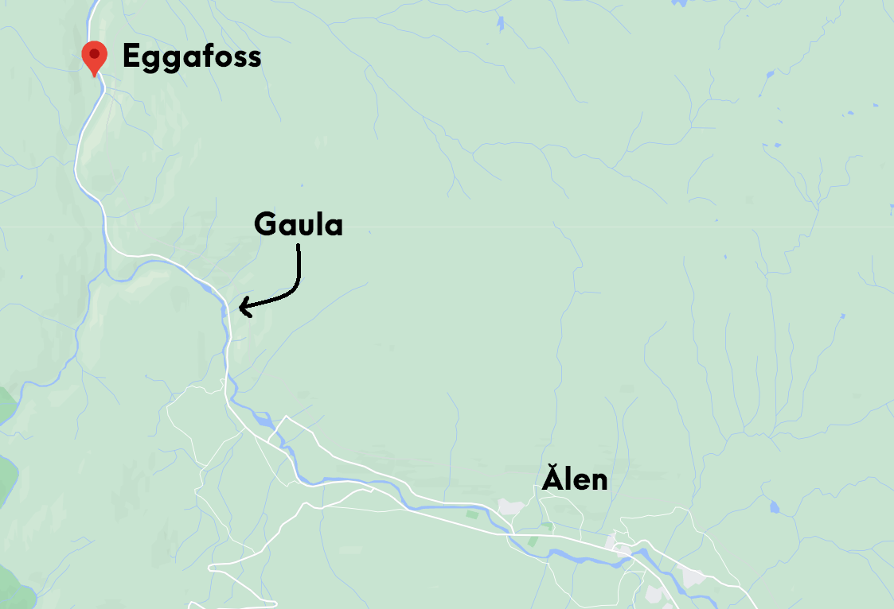

```{r setup, include=FALSE, message=FALSE}
knitr::opts_chunk$set(echo = TRUE)

library(data.table)
library(naniar)
library(reshape2)
library(ggplot2)
library(ggcorrplot)
library(h2o)
library(dplyr)
library(lubridate)
library(fastDummies)
library(glmnet)
library(leaps)
library(caret)
```

# Introduction

## Water Flow and Water Level

Statistical prediction of water flow (norsk: vannføring) and water level (norsk: vannstand) in rivers is an increasingly important problem. The problem is tightly linked with the prediction of floods. Because of climate change, the occurrence of floods is predicted to increase, and possibly in areas where floods have been historically rare:

[(Norwegian) Klima, nå og i framtiden](https://www.nve.no/klima/klima-na-og-i-framtiden/?ref=mainmenu)

Floods are potentially deadly for both humans and wildlife, and have huge economic consequences each year. Rivers are also an extremely important resource in many countries. In Norway, 90 % of produced electricity comes from hydropower:

[(Norwegian) Kraftproduksjon](https://energifaktanorge.no/norsk-energiforsyning/kraftforsyningen/)

Good statistical models for water discharge and water level are important in order to optimize the production of electricity. The <i>Norwegian Water Resources and Energy Directorate (NVE)</i> has about 600 water level measurement stations all over Norway:

[(Norwegian) Stasjonsnettet](https://www.nve.no/hydrologi/vannstand-og-vannforing/stasjonsnettet/)

Measurements are going as far back as the 1940's. The <i>Norwegian Meteorological Institute (MET)</i> is responsible for the developed weather measurement and forecasting infrastructure in Norway. Many variables obtained by weather measurements, such as temperature, percipitation and snow content are traditionally used in physical models for water discharge and water level. These physical models usually require parameter fitting and/or field experiments in order to yield good predictions. With the wealth of data available, it is worth considering purely data-driven approaches using measurements from NVE and MET to predict water discharge and water level. In this report we will attempt to apply statistical shrinkage models to predict water discharge at Eggafossen in Trøndelag, Norway. NVE was kind enough to give us water measurements and predictions from the model they are currently using, as well as weather data obtained from MET. 

## Eggafossen
Eggafossen is a location along the Gaula river in Trøndelag. Gaula as a whole is approximately 153 kilometers long and drains a watershed of about 3,661 square kilometres. The river runs through several populated areas as well as along the county road fv30, the highway E6 and the Rørosbanen train rail.

```{r pressure, echo=FALSE, fig.cap="Source: Google maps", out.width = '100%'}

```

In 2011 there was a large flood in Trøndelag, mainly along the upper parts of Gaula. In particular, Ålen kommune, which is one of the largest population centers close to Eggafossen, suffered large damages (bilde fra dagbladet https://www.dagbladet.no/nyheter/enorme-vannmasser-herjer-alen-sentrum/63582581). The Eggafoss station measured a water discharge about 800 000 litres per second, whereas it normally measures about 20 000-30 000. Even though NVE has the responsibility of warning about floods, the 2011 flood was not predicted or warned about by NVE, and precautionary measurements were not taken. NVE stated in their own report on the matter (https://publikasjoner.nve.no/dokument/2011/dokument2011_12.pdf):
"The risk of flood was underestimated because of several factors. The first percipitation predictions were too low. NVE's hydrological models were inadequate for the situation..."
This motivates research on better prediction models.

## The HBV model
The Hydrologiska Byråns Vattenbalansavdelig (HBV) model (https://en.wikipedia.org/wiki/HBV_hydrology_model, https://www.nve.no/hydrologi/analysemetoder-og-modeller/hbv-modellen/?ref=mainmenu) is a physical model designed for simulating river discharge based on an advanced water balance calculation, specifically designed for rivers in Scandinavia.
The HBV model uses several inputs for 
In particular, the parameters needed are daily precipitation, snow content and temperature. 
In order to fit the model one needs
around 9 parameters that are obtained through data fitting and/or field experiments.
The model is somewhat difficult to approach unless one has experience with hydrology, and we will not go into details here.

Because the HBV model most likely requires a data-driven fitting process, it is worth  asking: Is it possible to make comparable predictions to the HBV model 
using a purely data-driven model? The data driven model would have access to the same data
as the HBV model. If a purely data-driven model is shown to be as good or nearly as good as the HBV model, the model can easily be transferred to other measurement stations. Furthermore,
data-driven models can be used for inference in order to assess what actually causes discharge, and
can be used for confidence intervals and uncertainty measurements more easily than a physical model.

# Exploring the Data

The data from various csv-files from NVE is gathered into the file `raw_data_eggafoss.rds`.

```{r echo = FALSE}
# Importing data from Eggafoss
eggafoss = readRDS("data/raw_data_eggafoss.rds")

# Transform column names
names(eggafoss)[6:8] <- c("vannføring", "vannstand", "modellertvannføring")
names(eggafoss)
```

The data set consists of 8 features. They are all measured at 12:00 at the date of measurement.

- `dato`: date of measurements [yyyy-mm-dd]
- `nedbør`: rainfall [m]
- `snødekningsgrad`: snow coverage [%]
- `snøvannekvivalent`: snow's water equivalent [m]
- `temperatur`: temperature [°C]
- `vannføring`: water flow in river [m³/s]
- `vannstand`: water level in river [m]
- `modellertvannføring`: HBV's modelled water flow [m³/s]


As discussed above, we will use `vannføring` as the response, while the other features will become the predictors. We begin by gauging basic information about the data.

```{r echo = FALSE}
str(eggafoss)
```

```{r echo = FALSE}
summary(eggafoss)
```

We notice that `dato` is given in Date-format, while the other feaures are numerical. Most features, like `nedbør`, `snødekningsgrad`, `vannføring`, `vannstand` og `modellertvannføring`, takes on numerical values greater or equal to zero, while `temperatur` can attain negative values as well. `snødekningsgrad` is given in percent, so its range is between 0 and 100. The `dato` column shows that the collection of the data started in 1941 and goes all the up to the end of 2019, which means we have 78 years of daily data for some of our features. There also seems to be a lot of missing values is the dataset, which we will deal with below.

# Preprocessing and Exploratory Data Analysis

Before we can start fitting our data to different models, we have to preprosess the data and do some exploratory data analysis. The goal of this is making sure we have no missing values and that the data is transformed the way we want it, as well as get a initial feel for the features and their correlation with the response and with each other.

## Handeling Missing values

From the summary of the data above, we see that we are missing some values. We make a plot of the missing values to see just how much we are missing.

```{r echo = FALSE}
naniar::vis_miss(eggafoss)
```

We see that we are only missing data for a certain range of dates. From 1941 to 1958 we only have data on `vannføring` and `vannstand`, but nothing else. Since there is not much use predicting `vannføring` only from `vannstand` before 1958, we decide to remove these years from the dataset.

```{r}
# Remove data between 1941 and 1958
eggafoss = eggafoss[6120:28764, ]

# Any NA's left?
any(is.na(eggafoss))
```

After removing the missing data we are left with 22645 observations from Eggafoss, which includes daily data from January 1st 1958 to December 31st 2019.

```{r, echo = FALSE}
dim(eggafoss)
```

```{r, include = FALSE}
head(eggafoss)
```

## Examining Correlation

Now that we have removed all the missing values, we start exploring some of the underlying features of the data. We start by looking at the correlation between the covariates and the response.

```{r, echo = FALSE}
# Calculate the correlation between the features
corr = cor(eggafoss[, 2:8])

# Plot the correlation
ggcorrplot(corr, hc.order = TRUE, type = "lower", lab = TRUE,
   outline.col = "white",
   ggtheme = ggplot2::theme_gray,
   colors = c("#6D9EC1", "white", "#E46726"))
```

We see that the response `vannføring` is mostly corrolated with `modellertvannføring` and `vannstand`. We make a scatterplot of both of them against the response to see in more detail how they affect each other. To avoid to many points at once, we sample 3000 points from our data so that the underlying structure of the data becomes clearer.

```{r, message=FALSE, echo=FALSE}
# Extract 5000 samples
eggafoss_sample <- eggafoss[sample(nrow(eggafoss), 3000), ]

# Plot vannføring vs. modellertvannføring
ggplot(data = eggafoss_sample, aes(x = modellertvannføring, y = vannføring)) + 
  geom_point() +
  geom_smooth(colour = "orange", method = "lm") +
  labs(title = "Vannføring vs. modellertvannføring")
```

We see that `vannføring` and `modellertvannføring` are highly correlated, which is no big surprise since `modellertvannføring` is in fact the predicted value of `vannføring` from the HBV model. Thus it does not make sense for us to include this feature in our model. We will rather use the results from the HBV model as a baseline for the results from our own model, and see if we can improve on their results.

```{r, message=FALSE, echo=FALSE}
# Plot vannføring vs. vannstand
ggplot(data = eggafoss_sample, aes(x = vannstand, y = vannføring)) + 
  geom_point() +
  geom_smooth(colour = "orange", method = "lm") +
  labs(title = "Vannføring vs. vannstand")
```

The height of water in a river is intuitively correlated with the amount of water flow in the river. Low water level, low water flow, and vica versa. We see that the relationship is not linear, but looks more like like an exponential or quadratic function. Using `vannstand` to predict `vannføring` is a little bit problematic from a practical point of view. If we want to model the predicted water flow in a river, we most likely would not have any measurements of the water level that day. The other features, like `temperatur` and `snødekningsgrad` could be infered from good weather forcasting models, and thus would not pose the same practical problems. We conclude that when predicting the response, `vannstand` from the same day as the prediction will not be used.

We will also plot some of the covariates which have a high correlation with each other. This type of multicollinearity can cause problems in regular linear regression models, as it increases the standard error of the coefficients and thus some of the covariates can seem unsignificant, even though they are not. For the type of shrinkage methods we will use in this project, this multicollinearity will cause no problem, as the extra regularization term will regulate the size of the coefficients.

```{r, message=FALSE, echo=FALSE}
# Plot vannstand vs. temperatur
ggplot(data = eggafoss_sample, aes(x = temperatur, y = vannstand)) + 
  geom_point() +
  geom_smooth(colour = "orange", method = "lm") +
  labs(title = "Vannstand vs. temperatur")
```

We see that there is a positive trend between `vannstand` and `temperature`. It is most clear in the temperature interval between -10 and 5. This can indicate that `vannstand` is seasonal-dependend, and that a high water level occurs in the spring.

```{r, message=FALSE, echo=FALSE}
# Plot temperatur vs. snødekningsgrad
ggplot(data = eggafoss_sample, aes(x = temperatur, y = snødekningsgrad)) + 
  geom_point() +
  geom_smooth(colour = "orange", method = "lm") +
  labs(title = "Snødekningsgrad vs. temperatur")
```

We see that there is a negative correlation between `snødekningsgrad` and `temperature`, which again hints at a seasonal pattern. Below -10°C the snow coverage is at 100%. It starts decreasing once the temperature increases and winter becomes summer.

```{r, message=FALSE, echo=FALSE}
# Plot snødekningsgrad vs. snøvannekvivalent
ggplot(data = eggafoss_sample, aes(x = snøvannekvivalent, y = snødekningsgrad)) + 
  geom_point() +
  geom_smooth(colour = "orange", method = "lm") +
  labs(title = "Snødekningsgrad vs. snøvannekvivalent")
```

Between `snødekningsgrad` and `snøvannekvivalent` we see that there is somewhat of a linear relationship. The more snow covers the ground, the more water is produced when the show melts. Since `snødekningsgrad` only gives us the percentage of the ground covered by snow, it stops at 100%, and thus will not give us a good indication of how much snow there actually is on the ground. `snøvannekvivalent` can provide a better measure of this. Since the values are so similar, both might not be needed in our model, and might be removed, or set close to zero, by the shrinkage methods.

## Understanding the Seasonality of the Response

One of the features of our original data set is `dato`, the date at which each observation is measured. We cannot use this feature directly in building our model, but based on the analysis above, it might be beneficial to add some information about the time of each measurement, as seasonality is present in the data. To make an even stronger argument of this we look the response `vannføring` as a time series.

```{r, message=FALSE, echo=FALSE}
# Time series of vannføring
ggplot(data = eggafoss, aes(x = dato, y = vannføring)) +
  geom_line() + 
  geom_smooth(colour = "orange", method = "lm") + 
  labs(title = "Vannføring from 1958 to 2019")
```

From the plot above we see that there is definitely some trends in the data that repeats yearly. We take a closer look by plotting some of the year on top of each other.

```{r, echo=FALSE}
years = c(1960, 1980, 2000, 2019)

eggafoss %>%
  dplyr::mutate(year = factor(lubridate::year(dato))) %>%
  dplyr::filter(year %in% years) %>%
  ggplot() +
  geom_line(aes(x = lubridate::yday(dato), y = vannføring, group = year, col = year)) +
  ggtitle("Comparison of vannføring in 1960, 1980, 2000 and 2019") + 
  xlab("day")
```

We see that for the different years, a lot of the same trends are prevalent. During the winter month the water flow is usually very low, while during the spring and fall it increases dramatically. We make a boxplot of the `vannføring` for the different months:

```{r, echo=FALSE}
eggafoss %>%
  ggplot() +
  geom_boxplot(aes(group = lubridate::month(dato), x = lubridate::month(dato), y = vannføring)) + 
  ggtitle("Boxplot of monthly vannføring") + 
  xlab("month")
```

Based on the plot above we make an argument that an interesting covariate to add to our model is `month`, which gives information about which month the observaion is from. We could also have chosen to include season instead of month, but because of the diffuculty to divide the pattern we see into seasons we might loose some information, and instead choose to do the finer monthly division. Adding more variables than necessary should not be a problem in this project, as the regularization methods will remove the variables which are not significant for the prediction of the response.

## Adding information about previous days
We will attempt to model the response as
$$ f_n(t_{k+1}) = \beta_0 + \sum_{i = 1, i \neq n}^N \beta_i f_i(t_{k+1}) + \sum_{i =1}^N\sum_{j = 1}^d \beta_{(N-1)(1+i) + j}f_i(t_{k + 1 - j}),$$
where $f_n(t_{k+1})$ is the value of covariate $n$ at time $t_{k+1}$. The response `vannføring` is a linear model of other covariates on the same day (precipitation, temperature, snow) and the covariates including the response for the previous days. This way our model will capture not only the relevant paramters from the same day (assuming we have a good weather forecast, so precipitation, temperature and snow is known), but relevant parameters from previous days. The motivation behind this approach is that, for rivers, we would expect the water discharge to exhibit some delay in the response of the other covariates. For example, a heavy rainfall might lead to large water discharge after a couple of days as it takes time for the rainfall to travel through the soil into the river. In addition, we would expect a large change in snow (melting) will lead to large water discharge
when this melted water reaches the river.

The function implemented below makes it easy to specify how many years of the data you want to train on and how many of the previous day's data we want to include in the model. It outputs a test and training set, both as a dataframe and as a model matrix for the glmnet methods. We can train on up to 60 years of data, from 1958 to 2018. We always use 2019 as the test set, to see how well our method predicts a whole new year.

We want to emphasize that a linear model might not be the best way to model the response in this example, but as the problem will include a lot of covariates, some of which are highly correlated, it makes a great case study for the shrinkage methods.

```{r, echo=FALSE}
# Function which does all of the data preparation (also scaling and centering)

data_preparation = function(df, years, days) {
  
  # Only include specified years + 1 year for testing
  df = df %>% dplyr::filter(format(dato, "%Y") > (2019-years-3))
  
  # Which covariates we want to include
  doVannstand = FALSE
  doVannføring = TRUE
  doSnøvannekvivalent = TRUE
  doSnødekningsgrad = TRUE
  doNedbør = TRUE
  doTemperatur = TRUE
  
  sumDo = doVannstand + doSnøvannekvivalent + doSnødekningsgrad +
    doNedbør + doTemperatur + doVannføring
  names = length(names(df))
  
  # Extract information about previous days
  for (i in 1:days){
    len = length(df$dato)
    if (i == 1){
      do = 0
      if (doVannstand) {
        do = do + 1
        data = data.frame(c(NA,df$vannstand[1:(len-1)]))
        df = data.frame(c(df, data))
        name = paste("vannstand",i,"dager",sep="")
        names(df)[names+do] = name
      }
      if (doSnøvannekvivalent) {
        do = do + 1
        data = data.frame(c(NA,df$snøvannekvivalent[1:(len-1)]))
        df = data.frame(c(df, data))
        name = paste("snøvannekvivalent",i,"dager",sep="")
        names(df)[names+do] = name
      }
      if (doSnødekningsgrad) {
        do = do + 1
        data = data.frame(c(NA,df$snødekningsgrad[1:(len-1)]))
        df = data.frame(c(df, data))
        name = paste("snødekningsgrad",i,"dager",sep="")
        names(df)[names + do] = name
      }
      if (doNedbør) {
        do = do + 1
        data = data.frame(c(NA,df$nedbør[1:(len-1)]))
        df = data.frame(c(df, data))
        name = paste("nedbør",i,"dager",sep="")
        names(df)[names + do] = name
      }
      if (doTemperatur) {
        do = do + 1
        data = data.frame(c(NA,df$temperatur[1:(len-1)]))
        df = data.frame(c(df, data))
        name = paste("temperatur",i,"dager",sep="")
        names(df)[names + do] = name
      }
      if (doVannføring) {
        do = do + 1
        data = data.frame(c(NA,df$vannføring[1:(len-1)]))
        df = data.frame(c(df, data))
        name = paste("vannføring",i,"dager",sep="")
        names(df)[names + do] = name
      }
    }
    else {
      do = 0
      if (doVannstand) {
        do = do + 1
        data = data.frame(c(NA,df[1:(len-1), names + (i-2)*sumDo + do]))
        df = data.frame(c(df, data))
        name = paste("vannstand",i,"dager",sep="")
        names(df)[names+(i-1)*sumDo + do] = name
      }
      if (doSnøvannekvivalent) {
        do = do + 1
        data = data.frame(c(NA,df[1:(len-1), names + (i-2)*sumDo + do]))
        df = data.frame(c(df, data))
        name = paste("snøvannekvivalent",i,"dager",sep="")
        names(df)[names+(i-1)*sumDo + do] = name
      }
      if (doSnødekningsgrad) {
        do = do + 1
        data = data.frame(c(NA,df[1:(len-1), names + (i-2)*sumDo + do]))
        df = data.frame(c(df, data))
        name = paste("snødekningsgrad",i,"dager",sep="")
        names(df)[names+(i-1)*sumDo + do] = name
      }
      if (doNedbør) {
        do = do + 1
        data = data.frame(c(NA,df[1:(len-1), names + (i-2)*sumDo + do]))
        df = data.frame(c(df, data))
        name = paste("nedbør",i,"dager",sep="")
        names(df)[names+(i-1)*sumDo + do] = name
      }
      if (doTemperatur) {
        do = do + 1
        data = data.frame(c(NA,df[1:(len-1), names + (i-2)*sumDo + do]))
        df = data.frame(c(df, data))
        name = paste("temperatur",i,"dager",sep="")
        names(df)[names+(i-1)*sumDo + do] = name
      }
      if (doVannføring) {
        do = do + 1
        data = data.frame(c(NA,df[1:(len-1), names + (i-2)*sumDo + do]))
        df = data.frame(c(df, data))
        name = paste("vannføring",i,"dager",sep="")
        names(df)[names+(i-1)*sumDo + do] = name
      }
    }
  }
  
  # Remove the first days of the dataset where we don't have values for all the covariates
  df = na.omit(df)
  
  # Add month variable as factor
  df = df %>%
    dplyr::mutate(df, month = lubridate::month(dato))
  df$month = as.factor(df$month)
  
  # Make dummy variables
  df = fastDummies::dummy_cols(df, select_columns = "month",
                               remove_first_dummy = TRUE,
                               remove_selected_columns = TRUE)
  
  # Scale and center
  # Assuming date is always in the first column
  df[, -1] = scale(df[, -1], center = TRUE, scale = TRUE)
  
  # Split into training and test sets
  train = df %>% dplyr::filter(format(dato, "%Y") < 2018)
  test = df %>% dplyr::filter(format(dato, "%Y") >= 2018) 
  
  # Remove the first seven days of the test set, such that we get no leakage from the train set
  test = test[(days + 1):dim(test)[1], ]
  
  # Make data into model matrices
  x_train = model.matrix(vannføring~. -dato -vannstand -modellertvannføring, data = train)[,-1]
  y_train = train$vannføring
  
  x_test = model.matrix(vannføring~ .-dato -vannstand -modellertvannføring, data = test)[,-1]
  y_test = test$vannføring
  
  return(list(df, train, test, x_train, y_train, x_test, y_test))
}
```

# Modelling

We have chosen to use 40 years of data to train our model. Even though we have data from the last 60 years, we expect the quality of the data to have increased somewhat from 1958 to 2019, thus we find it unecessary to include all the data. We also think that 40 years of data should be sufficient to capture the underlying trends. We include data from the past 7 days as covariates, such that we might capture how snow melting, temperature change and percipitation can influense the response at a current date. If the later days do not influence the response, we hope that the models will detect this and remove them from the model.

We train on the observation between 1977 and 2017, and test the models on data from the years 2018 and 2019. The dimensions of the test and training set can be seen below. We will try to fit the data on traditional linear models, as well as some shrinkage methods to see which ones are best at prediction and inference. It is also of interest to see if we can beat HBV's modelled `vannføring` with our purely data-driven models.

```{r}
years = 40 # max 60, min 3 (since 2 years are automatically used for testing)
days = 7

data = data_preparation(eggafoss, years, days)
df = data[[1]]
train = data[[2]]
test = data[[3]]
x_train = data[[4]]
y_train = data[[5]]
x_test = data[[6]]
y_test = data[[7]]
```

```{r}
dim(train)
```

```{r}
dim(test)
```

## Traditional linear models

First we start of by fitting a linear model, a weighed linear model, and a best subset selection to our data. This is done such that we get an idea of which covariates might be significant to our model. Moreover, these methods then provide a benchmark for the shrinkage methods when it comes to prediction. We also hope that by using model selection we can increase the interpretability, and maybe also the prediction, of the linear model.

### Linear regression

We begin by fitting an the ordinary linear regression model:

```{r}
# Linear model
lm.fit = lm(vannføring~.-dato -vannstand -modellertvannføring, data = train)
summary(lm.fit)
```

As we can see, only a few of the 50 covariates are significant in the model. The linear model explains around 93% of the variability in the data. One should not completely trust the coefficient estimates as we know some of the covariates are highly correlated. We make a prediction of the response with the test set, and calculate the MSE of the linear model as a baseline for the other models.

```{r}
lm.pred = predict(lm.fit, test)
mean((test$vannføring - lm.pred)^2)
```

### Weighted linear regression

To make the linear model better adapted to the data, we introduce a weight that penalizes wrong predictions during the months where high water levels are common.

```{r}
# Initiate a weight that gives significant preference to months where high values for "vannstand" are appearing.
months_weight <- vector(length = dim(train)[1])
for (i in 1:dim(train)[1]) {
  if (train$month_4[i] == 1 | train$month_5[i] == 1 | train$month_6[i] == 1 | train$month_7[i] == 1 | train$month_9[i] == 1 | train$month_10[i] == 1) {
    months_weight[i] <- 50
  } else {
    months_weight[i] <- 1
  }
}
```

By fitting a weighted linear model, we get a lower error rate:

```{r echo=T, results='hide'}
weighted.lm.fit = lm(vannføring~.-dato -vannstand -modellertvannføring, data = train, weight = months_weight)
```

```{r}
summary(weighted.lm.fit)
weighted.lm.pred = predict(weighted.lm.fit, test)
(mean((test$vannføring - weighted.lm.pred)^2))
```

Notice that the adjusted R-squared statistic is almost 0.94, indicating that most of the variance in the data is accounted for by this model.

### Subset selection

We also want to see which variables a subset selection would choose, and if a linear model with these variables would preform better or as good as the linear model with all the covariates. We do both forward and backward selection, and choose the covariates which yields the smallect BIC and Cp values.

```{r}
# Subset model
fsub.fit = regsubsets(vannføring~ .-dato -vannstand -modellertvannføring, nvmax = 60, data = train, method="forward")

par(mfrow=c(2,2))

plot(summary(fsub.fit)$bic, xlab = "Number of Variables", ylab = "BIC", type = 'l', main = "BIC from Forward Selection")
l = which.min(summary(fsub.fit)$bic)
points(l, summary(fsub.fit)$bic[l], col="red", cex=2, pch=20)

plot(summary(fsub.fit)$cp, xlab = "Number of Variables", ylab = "Cp", type = 'l', main = "Cp from Forward Selection")
l = which.min(summary(fsub.fit)$cp)
points(l, summary(fsub.fit)$cp[l], col="red", cex=2, pch=20)

bsub.fit = regsubsets(vannføring~ .-dato -vannstand -modellertvannføring, nvmax = 60, data = train, method="backward")

plot(summary(bsub.fit)$bic, xlab = "Number of Variables", ylab = "BIC", type = 'l', main = "BIC from Backward Selection")
l = which.min(summary(bsub.fit)$bic)
points(l, summary(bsub.fit)$bic[l], col="red", cex=2, pch=20)

plot(summary(bsub.fit)$cp, xlab = "Number of Variables", ylab = "Cp", type = 'l', main = "Cp from Backward Selection")
l = which.min(summary(bsub.fit)$cp)
points(l, summary(bsub.fit)$cp[l], col="red", cex=2, pch=20)
```

We choose the covariates with the lowest BIC values from the backward selection.

```{r}
best = which.min(summary(bsub.fit)$bic)
coeffs = names(coef(bsub.fit, best))[2:length(coef(bsub.fit, best))]
train_subset = subset(train, select = c(coeffs))
train_subset["vannføring"] = train$vannføring

bestsub.fit = lm(vannføring~., data = train_subset)
summary(bestsub.fit)
```

We see that by using backward selection, the optimal model has 13 variables, which are all significant in the model. We observe that the temperature, amount of snow and amount of percipitation on the day of measurement is important, as well as the response value, precipitation, snow amount and temperature from some of the past days. Interestingly, the model does not care about the temperature at day 2, 3 or 4, but the temperature at day 5 becomes significant. The same can be seen for some of the other covariates. This could just be our model fitting noise in the data, but might also point to a delay in the covariates impact on the response, which the model manages to catch. Using the model on the test set yields the following MSE:

```{r}
bestsub.pred = predict(bestsub.fit, test)
mean((test$vannføring - bestsub.pred)^2)
```

Notice that since all the traditional methods are ultimately linear regressions, it is straightforward to obtain inference about the coefficients in the models. As an example, one can easily find confidence intervals by using `confint()`.

The table below gives a summary of the three traditional methods. Notice that the intercept is not included when counting the variables in the last column of the table. Although the weighted linear regression outperforms the others in terms of predictive power, the subset selection is not far behind and have removed many non-significant variables.

```{r table2, echo=FALSE, message=FALSE, warnings=FALSE, results='asis'}
tabl <- "
| Algorithm                  | Test MSE | Adjusted R-squared | Variables |
|----------------------------|:--------:|:------------------:|----------:|
| Linear Regression          | 41.13    | 0.932              | 50
| Weighted Linear Regression | 38.56    | 0.938              | 50
| Subset Selection           | 40.63    | 0.932              | 16
"
cat(tabl) # output the table in a format good for HTML/PDF/docx conversion
```

## Shrinkage models

In the data set we are working with we have a lot of covariates, many of which are not significant for our model. This motivates the use for shrinkage, or regularization, methods. These types of methods utilize the underlying assumption of simplicity in our data set, namely that only a few of the predictors actually play an important role in uncovering the signal in the data. We hope that by utilizing these types of methods we can remove/reduce the coefficients of the excessive covariates, to improve the prediction and interpretability of the model. Shrinkage methods are also good at dealing with multicollinearity, as they regulate the size of the coefficients efficiently.  

### Lasso model

The first model we will look at is the Lasso. The lasso is a shrinkage method which utilizes a $L_1$ penalty to shrink and remove some of the covariates in the model. The lasso coefficients are given by

$$ \hat{\beta}^{lasso} = \arg\min_{\beta} \left \{ \frac{1}{2}\sum_{i=1}^N (y_i - \beta_0 -\sum_{j=1}^p x_{ij}\beta_j)^2 + \lambda \sum_{j=1}^p |\beta_j| \right \}$$

To use this method we have to set the tuning parameter $\lambda$. The best way to do this is to do a cross validation. We will use the package glmnet's own implementation of cross validaton for choosing the optimal $\lambda$, using 10 folds.

```{r}
start = glmnet(x = x_train, y = y_train, alpha = 1, standardize = FALSE)
autolambda = start$lambda
lambdagrid = c(autolambda, 0.5, 0.3 ,0.2 ,0.1)

lasso.fit = glmnet(x = x_train, y = y_train, alpha = 1, lambda = lambdagrid, nfolds = 10, standardize = FALSE)
cvlasso.fit = cv.glmnet(x_train, y_train, alpha = 1, lambda = lambdagrid, nfolds = 10, standardize = FALSE)

plot(cvlasso.fit)
```

Above we see a plot of the MSE from the cross validation for the different values of $\lambda$. The first vertical bar shows the optimal $\lambda$, while the second bar shows the $\lambda$ one standard error above the minimal value. By choosing the one standard error $\lambda$ we will choose a slightly simpler model, whose error is still within one standard error of the minimal error. From the plot it does not seem like a heavily regularized method will preform better than a full linear model. The optimal lambda value is very close to zero, meaning that there is almost no regularization of the coefficients happening. We calculate the test MSE for the different $\lambda$ values, as well as for $\lambda$ equal to 0, 0.1 and 0.2.

```{r, include = FALSE}
for (i in c(0, cvlasso.fit$lambda.min, cvlasso.fit$lambda.1se, 0.1, 0.2)) {
  lasso = glmnet(x = x_train, y = y_train, alpha = 1, lambda = i, nfolds = 10, standardize = FALSE)
  pred = predict(lasso, s=i, newx = x_test)
  
  print(paste("Lambda: ", i))
  print(paste("Test MSE: ", mean((y_test - pred)^2)))
  print(paste("Number of non-zero coeffs: ", lasso$df))
  print(" ")
}
```

```{r table3, echo=FALSE, message=FALSE, warnings=FALSE, results='asis'}
table <- "
| Lambda    | Test MSE | Variables | 
|-----------|:--------:|:---------:|
| 0.0000    | 42.40    | 50              
| 0.00255   | 43.03    | 42              
| 0.01803   | 50.25    | 34              
| 0.10000   | 70.82    | 21             
| 0.20000   | 72.69    | 12             
"
cat(table) # output the table in a format good for HTML/PDF/docx conversion
```

We see that as expected, $\lambda = 0$ yields the smallest test MSE. As $\lambda$ increases the test MSE increases. To gain the same number of non-zero coefficients as in the backward subset model, we have to use a $\lambda$ value of around 0.2. This yields a test MSE of 72.7, which is an increase of the subset test MSE. We also take a look at the coefficients chosen by each model, for the minimum and 1se $\lambda$, as well as 0.2:

```{r}
coefficients = cbind(coef(lasso.fit, s = cvlasso.fit$lambda.min), coef(lasso.fit, s = cvlasso.fit$lambda.1se), coef(lasso.fit, s = 0.2))
colnames(coefficients) = c("lambda min", "lambda 1se","lambda 0.2")
print(coefficients)
```

We see that most of the values removed by the less penalized methods are also removed in the penalized methods. For the coefficients set to zero in the most penalized model, we see a decrease in the coefficient value between the model with the minimum lamda and the 1se lambda, which is what we expect. Some of the covariates, like `nedbør` and `nedbør1dager` have very big coefficients, which seems a little bit weird. One of the downsides to lasso is that groups of highly correlated variables can make the performance bad, and the coefficient paths can show some weird behavior. We look at a plot of the coefficients for the different $\lambda$s.

```{r}
plot(lasso.fit, xvar = "lambda", label = TRUE)
abline(v=log(cvlasso.fit$lambda.min))
abline(v=log(cvlasso.fit$lambda.1se))
abline(v=log(0.2))
```

We see that some of the values are very high, while others seems to decrease and then increase again. This might indicate that lasso is not suitable for our problem.

From a pure prediction point of view, the best model would be the one yielding the smallest test MSE, which is the one with the smallest $\lambda$ value.

```{r}
cvlasso.pred = predict(lasso.fit, s = cvlasso.fit$lambda.min, newx = x_test)
mean((y_test - cvlasso.pred)^2)
```

Choosing this model we get a test MSE very similar to the linear regression model, used 8 variables less. We still have 42 variables in our model, which makes interpretability of the model difficult. We want a smaller subset of variables to get information about which of our predictors are most important, which can help us identify the causes of floods at Eggafoss. For this purpose it would be better to choose the model with $\lambda = 0.2$. It gives a decrease in prediction power for the increase in interpretability.

In the traditional linear models studied above it is easy to determine the "statistical strength" or the significance of the included variables. Doing this for the lasso proves more of a challenge. One way to do this is to use the Bayesian lasso, which will give us the posterior distributions for the $\beta_j$ in the model. Another is to use bootstrapping. Since we have enough data to have a separate test set, we will use a slightely simpler method where we use the selected covariates from lasso in a linear model, fitted on the test data. From this we can get an estimate of the p-value and confidence interval of the coefficients $\beta_j$. In this way lasso is only used for model selection, while a linear regression model is used for the model assessment. We will use the 12 variables chosen by the lasso model with $\lambda = 0.2$.

```{r}
coeffs = c("nedbør", "temperatur", "snødekningsgrad1dager", "nedbør1dager",
           "vannføring1dager", "nedbør2dager", "snøvannekvivalent5dager",
           "snøvannekvivalent6dager", "snøvannekvivalent7dager", "month_3", "month_5", "month_6")

lasso_subset = subset(test, select = c(coeffs))
lasso_subset["vannføring"] = test$vannføring

inference.fit = lm(vannføring~., data = lasso_subset)
summary(inference.fit)
```

We see that only 6 of the 12 covariates have a p-value which would be considered significant. We can also look at the 95% confidence intervals below.

```{r}
confint(inference.fit, level = 0.95)
```

For the significant variables, the confidence intervals seem good. For all the non-significant variables, the confidence intervals all include 0, which implies that these are perhaps not the best subset of predictors.

### Elastic net model

We have seen that the normal lasso wit the $L_1$ penalty did not seem well suited for our data. We therefore consider some generalizations of the lasso, obtained by varying the loss function. By comparing the $L_1$ and $L_2$ penalty we obtain the elastic net method. This method might deal better with the correlated groups in our data. The elastic net coefficients are given by

$$ \hat{\beta}^{elastic \ net} = \arg\min_{\beta} \left \{ \frac{1}{2}\sum_{i=1}^N (y_i - \beta_0 -\sum_{j=1}^p x_{ij}\beta_j)^2 + \lambda \sum_{j=1}^p ((1-\alpha)\beta_j^2 + \alpha|\beta_j|) \right \},$$

where $\alpha$ is a parameter between 0 and 1. If $\alpha = 1$, the problem is reduced to the normal lasso, while if $\alpha = 0$ we have the ridge regression. We use the package caret to do a grid search over both $\alpha$ and $\lambda$, to find the optimal elastic net model. To do this we use a cross validation with 10 folds, and repeat the cross validation 5 times to obtain less variance in the cross validation error. We exclude 1 from the possible $\alpha$ values, to stop the model for choosing a pure lasso.

```{r, cache = TRUE}
control <- trainControl(method = "repeatedcv", 
                              number = 5, 
                              repeats = 5, 
                              search = "random")

elastic_model <- train(vannføring~.-dato -vannstand -modellertvannføring, 
                       data = train, 
                       method = "glmnet",
                       tuneLength = 25,
                       trControl = control) 

elastic_model
```

From the cross validation results $\alpha = 0.8814$ and $\lambda = 0.0020$ are chosen as the optimal values yielding the lowest RMSE. Normally, we should be careful simply choosing the parameters yielding the smallest error, as there could still be some overfitting happening even though the risk of this is mitigated some when using cross validation. In this case we have a lot of training data from many years, and we don't expect the variance in the data between the training years is any smaller than for normal years. We would therefore not expect much overfitting during our fitting, especially not for non-flexible models like elastic net.

The chosen $\alpha$ values hints at a model closest to lasso, but with some of the $L_2$ penalty from the ridge also. Since $\lambda$ is still very close to zero, the effect of the penalization are small, and we do not expect a much better model than the linear one. We calculate the test MSE.

```{r}
elastic.fit = glmnet(x = x_train, y = y_train, alpha = elastic_model$bestTune$alpha, lambda = elastic_model$bestTune$lambda, standardize = FALSE)

elastic.pred = predict(elastic.fit, s = elastic_model$bestTune$lambda, newx = x_test)
mean((y_test - elastic.pred)^2)
```

The value is close to, but a little bit higher than, the error from the lasso with the smallest optimal $\lambda$ value. It also includes more variables, which we see as a setback in this problem, as we don't think you need all 45 variables to explain most of the variability in the response. We conclude that an elastic net model does not perform better than lasso for our observations, and that both have proven not suitable for our temporal problem.

Since we have a temporal aspect to our data, we might wish for continuity in time-neighboring coefficients. The fused lasso is a method naturally tailored to such situations.

### Fused lasso model

# Comparison and conclusion

```{r table4, echo=FALSE, message=FALSE, warnings=FALSE, results='asis'}
tabl <- "
| Model                 | Test MSE | Variables | 
|-----------------------|:--------:|:---------:|
| Linear model          | 00000    | 00              
| Weighted linear model | 00000    | 00              
| Backward selection    | 00000    | 00              
| Lasso                 | 00000    | 00             
| Elastic net           | 00000    | 00 
| Fused lasso           | 00000    | 00  
"
cat(tabl) # output the table in a format good for HTML/PDF/docx conversion
```

```{r}
# Rekkefølge på ting som skal plottes
variable_vec = c("vannføring", "modellertvannføring", "lasso")

test %>%
  dplyr::mutate(lasso = cvlasso.pred) %>%
  tidyr::pivot_longer(tidyselect::all_of(variable_vec)) %>%
  dplyr::mutate(name = factor(name, levels = variable_vec)) %>%
  ggplot(aes(x = dato, y = value, group = name, col = name, linetype = name)) +
  geom_line() +
  scale_color_manual(values = c("black", "blue", "red")) +
  labs(col = "legend", linetype = "legend")
```